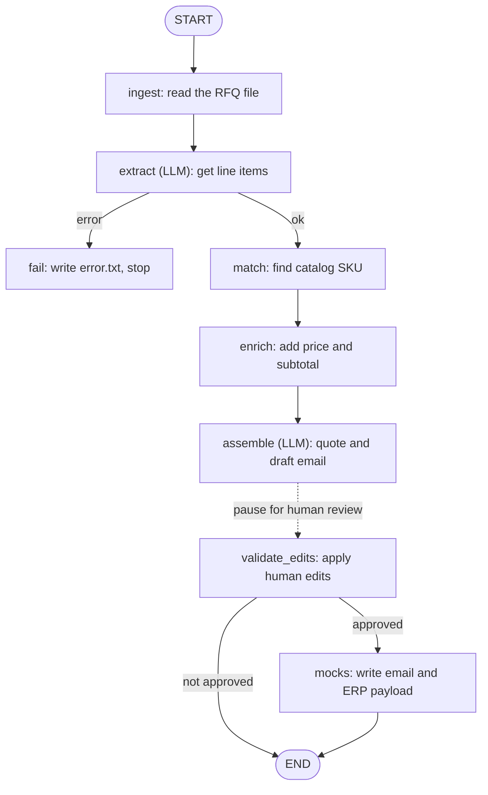

# rfq2draft

RFQ-to-quote drafting agent prototype for a Fastlane AI. It ingests distributor RFQs (PDF or email), extracts line items, matches them to a product catalog with a deterministic scorer, enriches pricing, and produces a reviewable quote package plus a draft reply email for human approval before any mocked send or ERP write.

## Contents

- [Architecture](#architecture)
- [Prerequisites](#prerequisites)
- [Setup](#setup)
- [Quickstart (CLI)](#quickstart-cli)
- [Quickstart (UI)](#quickstart-ui)
- [Why each RFQ is interesting](#why-each-rfq-is-interesting)
- [Verify everything](#verify-everything)
- [Costs and time](#costs-and-time)
- [What is mocked and why](#what-is-mocked-and-why)
- [Repo map](#repo-map)

## Architecture

The pipeline is a [LangGraph](https://github.com/langchain-ai/langgraph) state machine with seven nodes and a checkpointed interrupt in the middle, so a human reviews the quote before anything is sent or written to the ERP. The graph is defined in `src/rfq_agent/graph.py`; state is persisted per run to `runs/checkpoints.db` via `SqliteSaver`.



| Node | What it does | LLM? |
|---|---|---|
| `ingest` | Parses the RFQ (`pypdf` for PDF, stdlib `email` for `.eml`) into a normalized `RFQDocument`. | No |
| `extract` | Reads the document into structured line items (`ExtractedRFQ`), each with a confidence score and the verbatim source text. Schema-validated with one retry on failure. | Yes, call 1 |
| `fail` | Reached only if extraction fails validation twice. Writes `error.txt` and raises. | No |
| `match` | Three-rung deterministic scorer: exact SKU is authoritative, a SKU not in the catalog is flagged as `unknown_sku` and never substituted, and a line with no SKU goes through a weighted attribute scorer. | No |
| `enrich` | Attaches unit price, lead time, and stock from the catalog in `Decimal` math, and flags `stock_shortfall` or `deadline_risk`. | No |
| `assemble` | Builds the reviewable `QuotePackage` and drafts the reply email. A numeric guard checks that the only dollar amount in the email body is the subtotal, with one regeneration attempt and a deterministic template fallback. | Yes, call 2 |
| `validate_edits` | Re-reads the reviewer's edited JSON, applies overrides, and recomputes every derived value from the catalog. Blocks finalize if any flagged line is still unresolved or `approved` is not `true`. | No |
| `mocks` | Writes the mocked outputs: `quote.md`, `quote.pdf`, `sent_email.txt`, `sent_email.eml`, and `intacct_payload.json`. | No |

**Matching (rung 3, `src/rfq_agent/scoring.py`).** When a line has no SKU, each catalog product is scored against the attributes the RFQ line actually specifies (hose ID weight 0.25, construction 0.20, category 0.15, pressure 0.10, material 0.10, end fittings 0.10, length 0.10), gated so a wrong hose ID or under-rated pressure disqualifies a candidate outright rather than scoring as a near miss. A match auto-accepts only if its score is at least 0.80, it leads the runner-up by at least 0.10, and the line's extraction confidence is at least 0.60; otherwise it is flagged `low_confidence` or `no_match` and a person decides. Thresholds live in `src/rfq_agent/config.py`.

**Why this shape.** The LLM touches exactly two call sites, extraction and email prose. Everything involving money, matching, or totals is ordinary, testable code, so a hallucination can produce a flagged line but never a wrong price. `src/rfq_agent/runner.py` exposes `process_run` and `finalize_run`; both the CLI (`cli.py`) and the Streamlit UI (`app.py`) call the same two functions and edit the same `runs/<run_id>/quote_package.json`, so the system runs end to end from the terminal with no UI dependency.

## Prerequisites

- Python 3.11+
- An Anthropic API key (`ANTHROPIC_API_KEY`)

## Setup

About 2 minutes.

```bash
cd rfq2draft
python3 -m venv .venv
source .venv/bin/activate          # Windows: .venv\Scripts\activate
pip install -r requirements.txt
pip install -e .
cp .env.example .env               # then put your key on the ANTHROPIC_API_KEY= line
```

## Quickstart (CLI)

Process the hardest sample (no SKUs; one ambiguous line the agent will not guess):

```bash
python -m rfq_agent process rfqs/RFQ-003_PiedmontHydraulics.pdf
```

Open `runs/RFQ-003_PiedmontHydraulics/review.md`. It shows what the agent did and why: extraction, match rationale, prices, and the draft email.

Resolve the flagged line by editing `runs/RFQ-003_PiedmontHydraulics/quote_package.json`. Set `approved` to `true` and add an override for line 6, for example:

```json
"approved": true,
"overrides": [
  {
    "line_no": 6,
    "action": "replace_sku",
    "replacement_sku": "SHF-PTFE-025",
    "note": "Buyer confirmed PTFE / chemical service"
  }
]
```

Then finalize:

```bash
python -m rfq_agent finalize RFQ-003_PiedmontHydraulics
```

That writes `runs/RFQ-003_PiedmontHydraulics/sent_email.txt` and `runs/RFQ-003_PiedmontHydraulics/intacct_payload.json`.

To reject instead:

```bash
python -m rfq_agent finalize RFQ-003_PiedmontHydraulics --reject --reason "customer pricing under negotiation"
```

## Quickstart (UI)

```bash
streamlit run app.py
```

1. Pick an RFQ in the sidebar and click **Process RFQ** (spinner while extraction + email run).
2. Review the flag summary and expanders (flagged lines open by default).
3. For a flagged line, choose a candidate and an action (accept / replace / remove).
4. Click **Approve & Finalize** (or **Reject** with a reason).

The UI writes the same `runs/<run_id>/quote_package.json` the CLI path edits; both call the same `process_run` / `finalize_run` code.

## Why each RFQ is interesting

- **RFQ-001**: clean tabular PDF. Every line has a valid SKU, so this is the exact-match path.
- **RFQ-002**: email with two SKUs plus two attribute-only lines, so both the exact-match and weighted attribute paths run.
- **RFQ-003**: informal PDF with no SKUs. Five lines resolve on attributes alone, and line 6 is deliberately sparse so the agent flags a tie instead of guessing.
- **RFQ-004**: email table with a SKU that is not in the catalog (`SHF-H2-0625`). It is flagged as `unknown_sku` and never auto-substituted.
- **RFQ-005**: a self-authored rush email, added to show the agent generalizes past the four provided samples. It mixes exact SKUs, attribute-only lines, an underspecified line, and an unknown SKU, and it is the only sample that triggers a stock shortfall and a deadline risk flag together. See `SAMPLE_DATA_NOTES.md` for the full breakdown.

## Verify everything

```bash
./scripts/verify_samples.sh
```

Makes real Anthropic API calls (pennies). Success ends with `ALL SUITES GREEN` and covers schemas, deterministic SKU pricing, attribute matching, live extraction, assembly/email guard, and process/finalize roundtrips (happy edit, flagged override, reject).

## Costs and time

About 2 Claude calls per RFQ (extract + email). Wall time is usually tens of seconds per RFQ. API cost is typically under $0.05 per RFQ at current Sonnet pricing.

## What is mocked and why

Outbound email send and Sage Intacct writes are mocked by default. Finalize writes `quote.md` (customer quotation), `sent_email.txt`, `sent_email.eml` (a real email file with the quotation attached), and a production-shaped `intacct_payload.json` under `runs/<run_id>/`, instead of calling SMTP or Intacct. That keeps the assessment focused on agent logic and the human approval gate. Production auth, objects, failure handling, and where the gate sits are described in `DECISION.pdf`.

### Optional: real email send via Gmail (off by default)

Sending is disabled unless you opt in. To enable it, set `GMAIL_ADDRESS` and `GMAIL_APP_PASSWORD` (a Gmail App Password, which requires 2-Step Verification) in `.env`. Then send an approved quote:

```bash
python -m rfq_agent send <run_id> --to you@example.com
```

Or use the "Send this quote for real via Gmail" panel in the UI. Sending only works on an approved quote, is idempotent (it will not double-send without `--force`), and the sample RFQ recipient domains are fictional, so send to your own address instead. No credentials live in the code; both values are read from the environment.

## Repo map

```
src/rfq_agent/          package: schemas, ingest, extract, match, enrich, assemble, graph, CLI
src/rfq_agent/nodes/    pipeline node functions
src/rfq_agent/prompts/  extraction.md and email.md, the only two LLM call sites
src/rfq_agent/scoring.py  attribute scorer (rung 3)
catalog/                product_catalog.csv, standing in for the ERP product master
rfqs/                   five sample RFQs (PDF and .eml)
fixtures/extracted/     hand-written ExtractedRFQ JSON for offline matcher tests
runs/                   per-run artifacts and checkpoints.db (gitignored contents)
scripts/                verify_*.py and verify_samples.sh
app.py                  Streamlit review UI
DECISION.pdf            decision doc: problem choice, architecture, and tradeoffs
```
